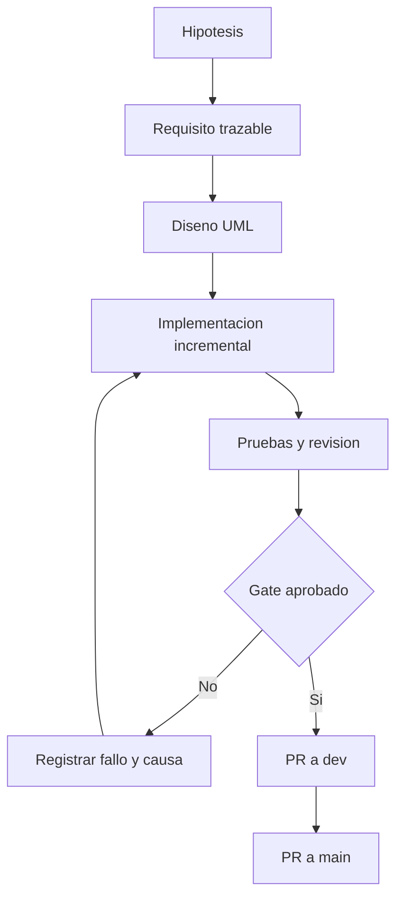

# Como construiremos Penguin Legacy sin perder la nostalgia ni la trazabilidad?

TL;DR: Penguin Legacy es un fan project gratuito y escalable; primero validamos el loop local, luego agregamos persistencia y solo despues evaluamos red, cuentas y publicacion.

## Estado

Fase actual: **F0 - fundacion documental**.

El repositorio contiene la especificacion, los criterios de calidad y los modelos que deben aprobarse antes de crear gameplay. `main` no se usa como rama de trabajo.

## Principios no negociables

1. La experiencia se desarrolla por incrementos verificables.
2. Cada requisito tiene una fuente, un criterio de aceptacion y una prueba.
3. Cada decision importante queda en una ADR.
4. Cada diagrama tiene una fuente editable.
5. Cada asset tiene procedencia y licencia registradas.
6. No se publican secretos, binarios ni contenido privado.
7. No se hace commit directo a `main`.
8. Un gate fallido mantiene abierta la fase.

## Flujo de trabajo

## Documentacion

- [Mapa documental](docs/00-mapa-documentacion.md)
- [Vision y alcance](docs/01-vision-y-alcance.md)
- [Requisitos y co-creacion](docs/02-requisitos-y-co-creacion.md)
- [Ciclo de vida](docs/03-ciclo-de-vida-iso-12207.md)
- [Arquitectura y patrones](docs/04-arquitectura-y-patrones.md)
- [Modelos UML](docs/05-modelos-uml.md)
- [Casos de uso y abuso](docs/06-casos-de-uso-y-abuso.md)
- [Calidad y metricas](docs/07-calidad-y-metricas.md)
- [Legalidad, privacidad y derechos](docs/08-legal-privacidad-y-derechos.md)
- [Mercado y nostalgia](docs/09-mercado-y-nostalgia.md)
- [Procedencia de assets](docs/10-procedencia-de-assets.md)
- [Matriz de trazabilidad](docs/11-matriz-de-trazabilidad.md)
- [Protocolo de investigacion de usuarios](docs/12-protocolo-investigacion-usuarios.md)
- [Gate F0](docs/13-gate-f0.md)
- [Sistemas y subsistemas](docs/14-sistemas-y-subsistemas.md)
- [Roles y responsabilidades](docs/15-roles-y-responsabilidades.md)
- [ADR-0001: fan project publico](docs/decisions/ADR-0001-fan-project-publico.md)

La politica de seguridad del repositorio esta en [SECURITY.md](SECURITY.md).

## Aviso, creditos y derechos

Este es un fan project gratuito y no afiliado. Los creditos y el canal de
solicitudes de retirada estan en [CREDITS.md](CREDITS.md). La licencia del
codigo y la documentacion propios esta en [LICENSE](LICENSE). Una atribucion
no sustituye una licencia o permiso del titular correspondiente.

## Sello Penguin Legacy

Una fase solo se cierra cuando tiene evidencia de requisitos, pruebas, calidad, seguridad, procedencia de assets y revision humana. El sello tecnico no equivale a autorizacion legal; cualquier riesgo legal no resuelto se marca explicitamente.

## Contribuir

Las contribuciones deben indicar el requisito o ADR afectado, incluir pruebas y actualizar la documentacion correspondiente. El flujo de ramas esta definido en `docs/03-ciclo-de-vida-iso-12207.md`.

## Over to you

La siguiente revision debe confirmar la vision F0, el usuario objetivo y los criterios de aceptacion antes de crear gameplay.
