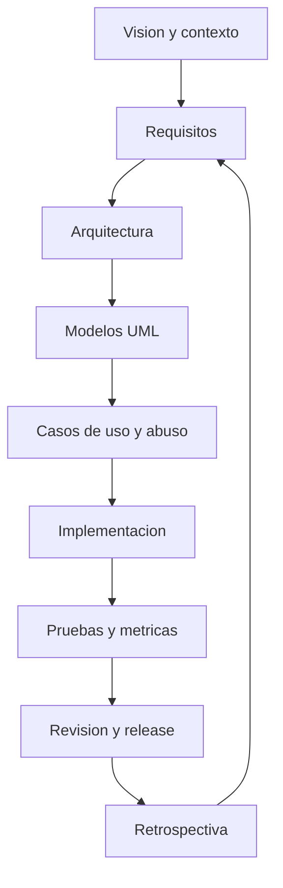

# Como se organiza la documentacion del proyecto?

TL;DR: la documentacion avanza desde la vision y el contexto hacia requisitos, diseno, implementacion, pruebas y release.

## 1. Capas documentales

| Capa | Documento | Pregunta que responde |
|---|---|---|
| Producto | `01-vision-y-alcance.md` | Que problema y experiencia queremos validar? |
| Requisitos | `02-requisitos-y-co-creacion.md` | Que debe hacer el sistema y para quien? |
| Proceso | `03-ciclo-de-vida-iso-12207.md` | Como se transforma una idea en release? |
| Diseno | `04-arquitectura-y-patrones.md` | Como se separan responsabilidades y limites? |
| Modelado | `05-modelos-uml.md` | Como representamos estructura, flujo y estados? |
| Riesgo | `06-casos-de-uso-y-abuso.md` | Que puede hacer el usuario y que puede salir mal? |
| Calidad | `07-calidad-y-metricas.md` | Como sabemos que funciona y por que falla? |
| Cumplimiento | `08-legal-privacidad-y-derechos.md` | Que obligaciones y riesgos existen? |
| Mercado | `09-mercado-y-nostalgia.md` | Que hipotesis de valor debemos validar? |
| Contenido | `10-procedencia-de-assets.md` | Podemos publicar cada recurso? |
| Trazabilidad | `11-matriz-de-trazabilidad.md` | Que evidencia conecta requisito y prueba? |
| Investigacion | `12-protocolo-investigacion-usuarios.md` | Como aprendemos sin retener datos innecesarios? |
| Gate | `13-gate-f0.md` | Como verificamos F0 sin automatizacion propia? |
| Sistemas | `14-sistemas-y-subsistemas.md` | Donde estan las fronteras de confianza? |
| Organizacion | `15-roles-y-responsabilidades.md` | Quien puede decidir, revisar y publicar? |
| Decisiones | `decisions/ADR-*.md` | Por que elegimos este camino? |

## 2. Regla de actualizacion

Cada cambio de alcance debe actualizar requisitos, diagramas afectados, casos de abuso, metricas y ADRs. No se reescribe la historia: se registra el delta y su motivo.

## 3. Fuentes de diagramas

- Mermaid: archivos Markdown en `docs/assets/` y diagramas eje dentro de documentos, todos con direccion `flowchart TD`.
- UML: archivos `.puml` en `docs/assets/`, editables y versionados.
- Cada imagen futura debe generarse desde una fuente versionada.

## 4. Gate documental F0

- Todos los enlaces internos y referencias de modelos resuelven.
- No hay requisitos sin criterio de aceptacion.
- No hay caso de uso sin caso de abuso revisado.
- No hay diagrama sin fuente editable.
- No hay obligacion legal afirmada sin articulo, fuente oficial y fecha de consulta.

## Over to you

Revisar este mapa antes de aceptar nuevos documentos o crear carpetas fuera de esta estructura.
