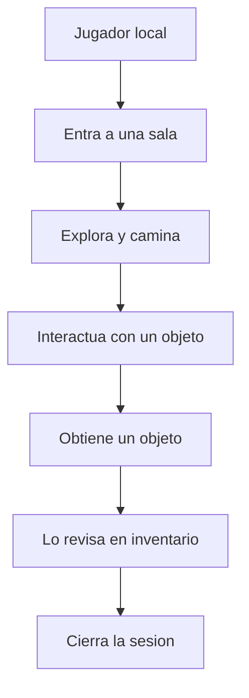

# Que experiencia vamos a validar primero?

TL;DR: F0 no intenta construir un MMO; valida una experiencia social local, simple y memorable en menos de diez minutos.

## 1. Vision

Crear un mundo social 2D original que recupere sensaciones de descubrimiento, calma, humor y coleccion sin depender de una copia literal de una franquicia.

La nostalgia es una hipotesis de producto, no una excusa para copiar una obra. Se validara mediante entrevistas, prototipos y pruebas de tarea.

## 2. Alcance F0

Incluye:

- Cliente Godot para Linux desktop.
- Una sala local.
- Un avatar placeholder con movimiento.
- Un objeto interactivo.
- Un objeto coleccionable.
- Inventario minimo.
- Documentacion, modelos y pruebas de dominio.

No incluye:

- Cuentas, chat, red o matchmaking.
- Monetizacion o compras.
- Datos personales reales.
- Publico infantil definido.
- Assets no verificados.
- Arte de produccion.

## 3. Hipotesis de valor

| ID | Hipotesis | Evidencia requerida |
|---|---|---|
| H-01 | La exploracion tranquila motiva a completar la primera sesion | Prueba de tarea y entrevista posterior |
| H-02 | Coleccionar un objeto hace memorable la sala | Recuerdo libre despues de la sesion |
| H-03 | Humor y sorpresa aumentan la intencion de volver | Encuesta y prueba de retorno |
| H-04 | La nostalgia se puede evocar sin copiar assets | Comparacion de emociones, no de imagenes |

## 4. Usuarios y ambiente

F0 se dirige a adultos que prueban un prototipo en Linux. No se asume que el producto este dirigido a menores ni que pueda manejar cuentas de menores. Esa decision queda abierta hasta un levantamiento posterior.

El ambiente futuro incluye cliente, sistema operativo, repositorio publico, posibles servidores, tiendas, usuarios, colaboradores, proveedores de assets y titulares de derechos.

## 5. Criterios de exito F0 documental

- Todos los requisitos F0 tienen criterio de aceptacion.
- Todos los casos de uso tienen un abuso o riesgo asociado.
- Todos los diagramas tienen fuente editable.
- Todas las obligaciones legales tienen fuente oficial, articulo y fecha.
- El gate documental tiene un procedimiento reproducible con Git, GitHub y Godot.

## 6. Criterios de exito F1 funcional

- Un usuario nuevo completa el loop sin instrucciones verbales del desarrollador.
- La escena carga en modo headless sin errores.
- El dominio mantiene sus invariantes con tests automatizados.
- El build funciona sin assets privados.
- La prueba registra exito, fallo y causa, no solo una opinion.

## 7. Trade-offs

| Decision | Beneficio | Costo |
|---|---|---|
| Empezar local | Reduce complejidad y riesgo | No valida comunidad real |
| Placeholders | Permite programar sin bloquearse por arte | Menor impacto emocional inicial |
| Dominio separado | Facilita pruebas y futura red | Mas estructura desde el inicio |
| Universo original | Reduce dependencia de terceros | Exige construir identidad propia |

## Over to you

La co-creacion debe validar H-01 a H-04 antes de ampliar el alcance.
