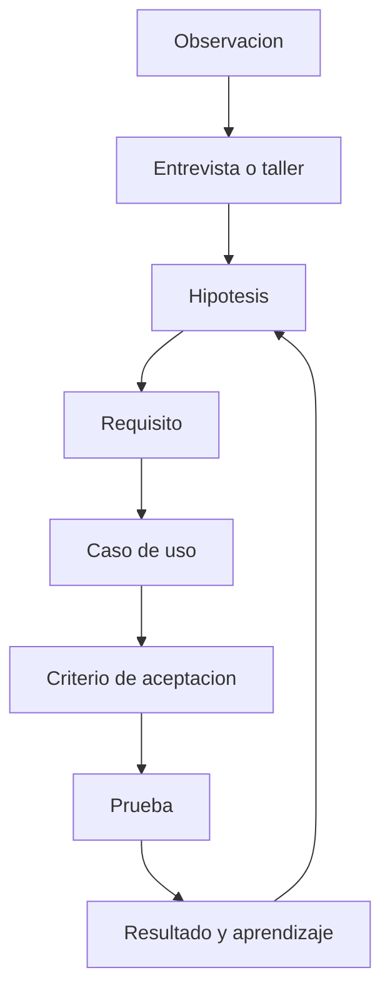

# Como convertimos ideas y nostalgia en requisitos verificables?

TL;DR: cada requisito nace de una hipotesis o necesidad observada, se prioriza, se modela y termina con una prueba de aceptacion.

## 1. Tecnicas de levantamiento

1. Entrevistas semiestructuradas para conocer recuerdos, frustraciones y motivadores.
2. Story mapping para ordenar la primera sesion, retorno y progresion.
3. Co-creacion con prototipos de baja fidelidad antes de producir arte.
4. Pruebas de tarea observadas, sin explicar el camino.
5. Encuestas cortas posteriores, separando emocion, claridad y deseo de retorno.
6. Registro de decisiones y desacuerdos en ADRs.

## 2. Requisitos funcionales F1

| ID | Requisito | Prioridad | Aceptacion |
|---|---|---|---|
| RF-001 | El jugador puede iniciar una sesion local | Must | La escena principal carga sin entrada externa |
| RF-002 | El jugador puede moverse en la sala | Must | El avatar responde a izquierda y derecha |
| RF-003 | El jugador puede interactuar con un objeto | Must | La interaccion produce un evento observable |
| RF-004 | El jugador puede obtener un item | Must | El inventario registra cantidad uno |
| RF-005 | El jugador puede consultar el inventario | Must | La UI muestra nombre y cantidad |
| RF-006 | El jugador puede cerrar la sesion | Should | El proceso termina sin error |

## 3. Requisitos no funcionales F0

| ID | Requisito | Prioridad | Aceptacion |
|---|---|---|---|
| RNF-001 | El dominio es testeable sin renderizar UI | Must | Runner headless disponible y documentado |
| RNF-002 | No se publican secretos ni binarios | Must | Revision de `git diff`, `git status` y GitHub |
| RNF-003 | Los assets tienen procedencia registrada | Must | Manifest o ausencia explicita |
| RNF-004 | Los diagramas tienen fuente editable | Must | Mermaid y PlantUML versionados |
| RNF-005 | Los errores no quedan ocultos | Should | Log y salida de tests conservan evidencia |
| RNF-006 | La documentacion se actualiza con el cambio | Must | Checklist de PR completo |

## 4. Priorizacion

Se usa MoSCoW en F0: Must sostiene el loop; Should mejora claridad; Could queda para una fase posterior; Won't es un limite explicito, no una promesa futura.

## 5. Preguntas abiertas

- Cual es el nombre publico definitivo?
- Quien es el usuario inicial de las pruebas?
- Se permitira contenido creado por usuarios?
- Habra publico menor en una futura version?
- Se buscara autorizacion formal para material de terceros?

## Over to you

Cada entrevista futura debe aportar evidencia a una hipotesis o crear una pregunta trazable; no se aceptan cambios basados solo en intuicion.
