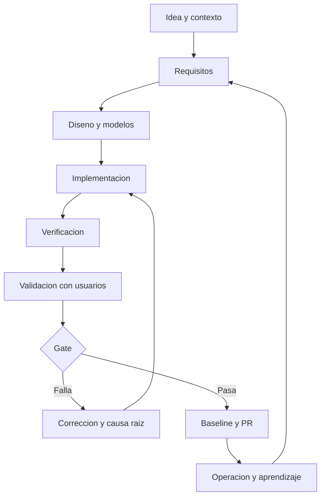

# Como gobernamos el ciclo de vida sin perder velocidad?

TL;DR: usamos un ciclo incremental e iterativo con gates; cada fase entrega evidencia pequena y reversible antes de abrir la siguiente.

## 1. Alineacion con ISO/IEC/IEEE 12207

Usamos ISO/IEC/IEEE 12207:2026, clausula 1 (Scope), como marco de procesos de ciclo de vida, no como afirmacion de certificacion. La pagina oficial consultada el 2026-10-01 es https://www.iso.org/standard/90219.html. ISO/IEC/IEEE 12207:2017 figura retirada en https://www.iso.org/standard/63712.html, consultada el 2026-10-01. La tabla siguiente es una adaptacion del proyecto, no una transcripcion de clausulas internas.

| Proceso | Aplicacion Penguin Legacy |
|---|---|
| Acuerdo | Alcance, contribuciones, licencias y criterios de entrega |
| Organizacion | Roles, ramas, revisiones y responsabilidad de decisiones |
| Tecnico | Requisitos, arquitectura, implementacion, integracion y pruebas |
| Gestion tecnica | Riesgos, configuracion, cambios, medicion y calidad |
| Operacion | Instalacion, ejecucion, soporte y respuesta a incidentes |
| Mejora | Retrospectiva, causas raiz y actualizacion de procesos |

## 2. Metodologia

Se combina:

- Iteracion corta para aprender pronto.
- Desarrollo incremental para entregar vertical slices.
- TDD en dominio y reglas de negocio.
- ADR para decisiones con trade-offs.
- Revision por PR antes de integrar.
- Threat modeling cuando aparezca red, identidad o contenido de usuarios.

No se adopta Scrum completo por nombre; se usan sus practicas utiles sin inventar ceremonias que no aporten evidencia.

## 3. Fases

| Fase | Salida | Gate |
|---|---|---|
| F0 | Documentacion, modelos y gate reproducible | READY documental |
| F1 | Sala, avatar, interaccion e inventario | GREEN funcional |
| F2 | Guardado versionado e intents locales | GREEN de persistencia |
| F3 | Minijuego original | GREEN de integracion |
| F4 | Red LAN experimental | Threat model aprobado |
| F5 | Backend y cuentas | Legal, seguridad y privacidad aprobados |

## 4. Git y releases

- `main`: releases verificadas; no se trabaja directamente.
- `dev`: integracion despues de revision.
- `docs/*`: documentacion.
- `feat/*`: slices funcionales.
- `fix/*`: correcciones aisladas.
- `test/*`: pruebas y gates.

Orden: rama corta, tests, revision, PR a `dev`, smoke completo, PR a `main`, tag de fase.

## 5. Gate F0

F0 no se cierra si falta un documento, un diagrama no renderiza, una fuente legal carece de articulo y fecha, un requisito no tiene aceptacion o un asset no tiene procedencia.

## Over to you

Las excepciones al proceso deben registrarse en una ADR, con motivo, riesgo, compensacion y fecha de vencimiento.
