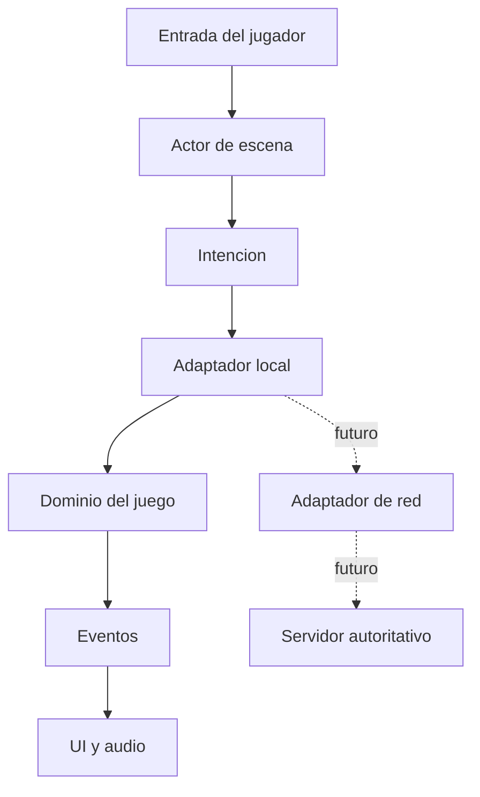

# Como creceremos sin reescribir el juego al agregar red?

TL;DR: separamos dominio, actores, escenas, datos y adaptadores para que el juego local pueda convertirse en cliente de un servidor sin mezclar responsabilidades.

## 1. Limites del sistema

| Modulo | Responsabilidad | No debe hacer |
|---|---|---|
| `core` | Estado de sesion, eventos y configuracion | Resolver reglas de negocio ocultas |
| `domain` | Entidades, invariantes y reglas | Depender de nodos de UI |
| `actors` | Traducir input a intenciones | Ser autoridad de inventario |
| `scenes` | Composicion visual y navegacion | Persistir datos arbitrarios |
| `data` | Definiciones de items y salas | Ejecutar logica de red |
| `net` | Contrato de transporte futuro | Autorizar acciones por si solo |
| `tests` | Evidencia ejecutable propuesta para F1 | Ser la unica documentacion |

## 2. Patrones aplicados

- Ports and Adapters: `net` separa el dominio de la tecnologia de transporte mediante un puerto explicito.
- State: las transiciones de sala y sesion son explicitas.
- Command: una accion del jugador se expresa como intencion.
- Observer: eventos actualizan UI sin acoplar dominio y escena.
- Data-driven design: items y salas son recursos declarativos.
- Repository, solo cuando exista persistencia real: no se agrega una abstraccion vacia en F0.

## 3. Teoria general de sistemas

El juego se modela como un sistema abierto con entradas, transformaciones, salidas, retroalimentacion y limites. El usuario y el sistema operativo son entorno; el dominio es el nucleo; la UI y los adaptadores son fronteras.

La retroalimentacion se mide con eventos de juego y pruebas de usuario. Un cambio local no debe romper invariantes globales; cada fase verifica relaciones entre componentes, no solo funciones aisladas.

## 4. Decisiones de escalabilidad

| Decision | Por que | Riesgo aceptado |
|---|---|---|
| Dominio sin nodos | Facilita tests y servidor futuro | Requiere adaptadores explicitos |
| Servidor futuro autoritativo | Protege inventario y progresion | Mayor latencia y complejidad |
| Datos declarativos | Facilita agregar contenido | Requiere validacion de catalogo |
| Sin base de datos en F0 | Reduce superficie y costo | No hay progreso entre equipos |

## Over to you

Una nueva dependencia debe declarar que limite cruza, que problema resuelve y que evidencia evita el acoplamiento accidental.
