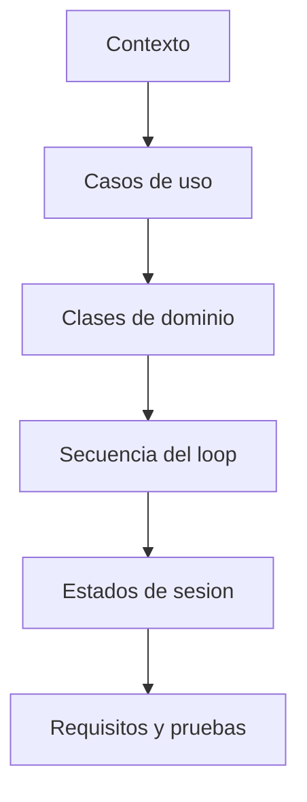

# Que modelos UML necesitamos para entender el sistema?

TL;DR: los modelos muestran estructura, responsabilidades, secuencias y estados; no reemplazan el codigo ni las pruebas.

## 1. Modelos versionados

| Archivo | Modelo | Uso |
|---|---|---|
| [`03-use-cases.puml`](assets/03-use-cases.puml) | UML use case | Actores y objetivos |
| [`04-domain-class.puml`](assets/04-domain-class.puml) | UML class | Entidades e invariantes |
| [`05-core-loop-sequence.puml`](assets/05-core-loop-sequence.puml) | UML sequence | Interaccion, item e inventario |
| [`06-session-state.puml`](assets/06-session-state.puml) | UML state | Ciclo de la sesion local |

## 2. Reglas de modelado

- Cada elemento importante debe tener un requisito o ADR relacionado.
- Los nombres del modelo coinciden con nombres del dominio, no con detalles temporales de UI.
- Las relaciones de red futura se marcan como futuras, no como funcionalidades existentes.
- Un diagrama no debe mostrar componentes que el repositorio aun no tiene sin etiquetarlos como propuesta.

## 3. Validacion

Mermaid se validara con el renderizador nativo de GitHub. PlantUML se mantendra como fuente editable y se validara con el editor o renderizador nativo disponible cuando el proyecto tenga ese entorno. Un diagrama roto bloquea el gate documental.

## Over to you

Los modelos se revisan junto con los requisitos, no al final como ilustracion.
