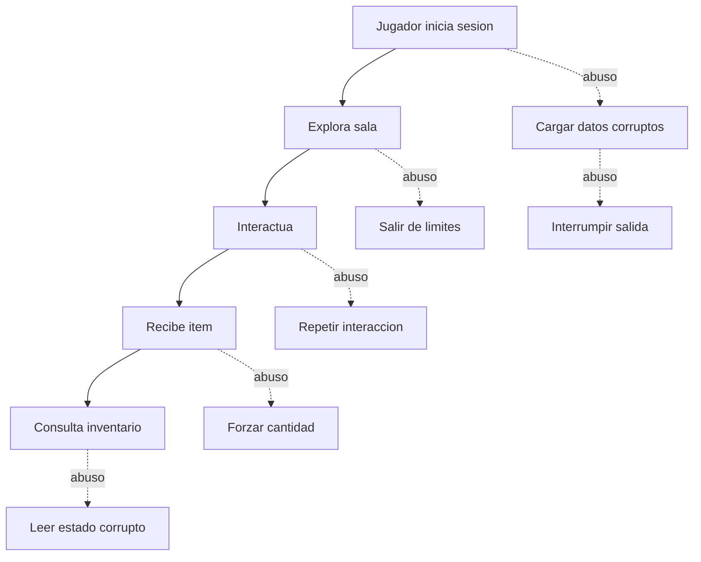

# Que puede hacer el usuario y como puede fallar el sistema?

TL;DR: cada flujo normal se analiza junto con su abuso, sus controles y una prueba reproducible.

## 1. Casos de uso base para F1 y F2

| ID | Fase | Actor | Caso | Resultado |
|---|---|---|---|---|
| CU-001 | F1 | Jugador | Iniciar sesion local | Sala disponible |
| CU-002 | F1 | Jugador | Mover avatar | Posicion valida |
| CU-003 | F1 | Jugador | Interactuar con objeto | Evento aceptado |
| CU-004 | F1 | Jugador | Obtener item | Inventario actualizado |
| CU-005 | F1 | Jugador | Consultar inventario | Estado visible |
| CU-006 | F2 | Jugador | Salir y guardar | Sesion finalizada |

## 2. Casos de abuso previstos

| ID | Fase | Abuso | Control | Prueba |
|---|---|---|---|---|
| AB-001 | F1 | Forzar carga local invalida | Validacion y error controlado | Cargar datos corruptos |
| AB-002 | F1 | Salir de los limites de la sala | Limite de dominio con clamp | Intentar posiciones invalidas |
| AB-003 | F1 | Repetir una recompensa | Idempotencia de la interaccion | Ejecutar dos veces |
| AB-004 | F1 | Manipular cantidad del item | Invariante de inventario | Test de limites |
| AB-005 | F2 | Leer estado corrupto del inventario | Validacion y recuperacion | Alterar estado local |
| AB-006 | F2 | Interrumpir salida o guardado futuro | Operacion atomica y versionado | Simular cierre durante save |

Los riesgos de repositorio, como publicar un asset sin licencia, se registran como riesgos de gobernanza y no como abusos de jugador.

## 3. Riesgos futuros

Cuando aparezcan red, cuentas o chat se agregan casos para suplantacion, replay, abuso de economia, acceso horizontal, spam, grooming, contenido malicioso, denegacion de servicio y fuga de logs. No se implementa una mitigacion imaginaria antes de tener el flujo definido.

## 4. Formato de reporte

Cada hallazgo futuro debe incluir: ID, flujo, precondicion, pasos, resultado observado, resultado esperado, impacto, severidad, evidencia, causa raiz, mitigacion y prueba de regresion.

## Over to you

Un caso de abuso no se cierra porque parezca improbable; se cierra con control, evidencia o una aceptacion de riesgo registrada.
