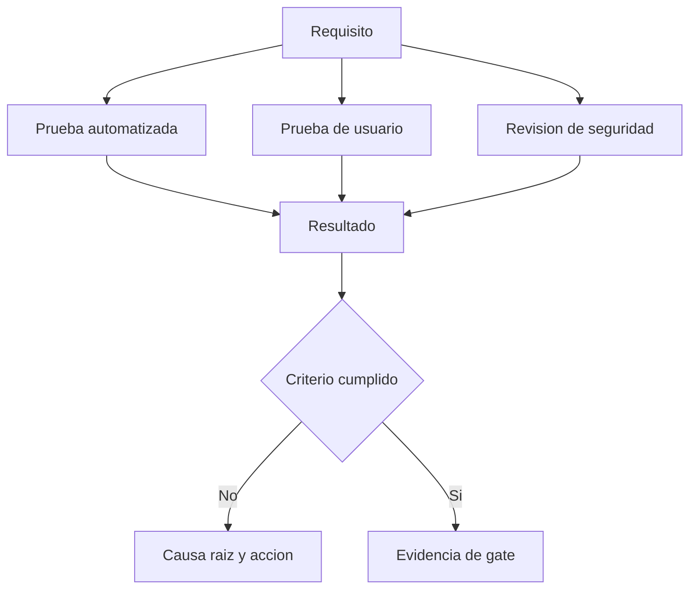

# Como medimos calidad, exito y fracaso?

TL;DR: calidad significa cumplir requisitos, resistir usos invalidos, ser entendible y dejar evidencia reproducible.

## 1. Calidad de producto

Usaremos ISO/IEC 25010:2023, edicion 2 publicada en 2023-11, clausula 4 (Product quality model), como referencia de calidad de producto, sin declarar certificacion. Fuente oficial consultada el 2026-10-01: https://www.iso.org/standard/78176.html. En F0 priorizamos adecuacion funcional, eficiencia, usabilidad, mantenibilidad y seguridad.

## 2. Metricas tecnicas

| Metrica | Formula | Gate inicial |
|---|---|---|
| Tests verdes | tests pasados / tests ejecutados | 100% |
| Fallos criticos abiertos | conteo de criticidad critica | 0 |
| Requisitos trazables | requisitos con prueba / total | 100% Must |
| Assets trazables | assets con manifest / total | 100% publicados |
| Escena headless | cargas correctas / intentos | 100% |
| Links documentales | links validos / links comprobados | 100% |

## 3. Metricas de usuario

| Metrica | Formula | Uso |
|---|---|---|
| Exito de tarea | tareas completadas / intentos | Descubrir friccion |
| Fracaso de tarea | tareas fallidas / intentos | Priorizar correcciones |
| Tiempo al primer logro | tiempo hasta obtener item | Medir claridad |
| Recuerdo emocional | respuestas positivas / respuestas validas | Validar nostalgia |
| Intencion de retorno | usuarios que volverian / respuestas validas | Validar valor |

Las tasas no se inventan: cada sesion registra denominador, muestra, fecha, version y sesgo conocido. F0 usa minimo 5 participantes adultos para aprendizaje cualitativo; no se presenta como estudio estadistico. Un resultado negativo es evidencia de aprendizaje, no motivo para ocultarlo.

## 4. Causa raiz

Los fallos se clasifican como requisito ambiguo, diseno incorrecto, implementacion, datos, entorno, prueba insuficiente o uso no previsto. Cada repeticion del mismo fallo abre una accion de proceso, no solo un parche.

## 5. Evidencia de cierre

- Comando ejecutado.
- Codigo de salida.
- Version del proyecto.
- Resultado completo.
- Captura o log cuando sea necesario.
- Riesgo residual.

## Over to you

Una demo que se ve bien pero no tiene denominador, prueba ni causa de fallo no es evidencia de calidad.
