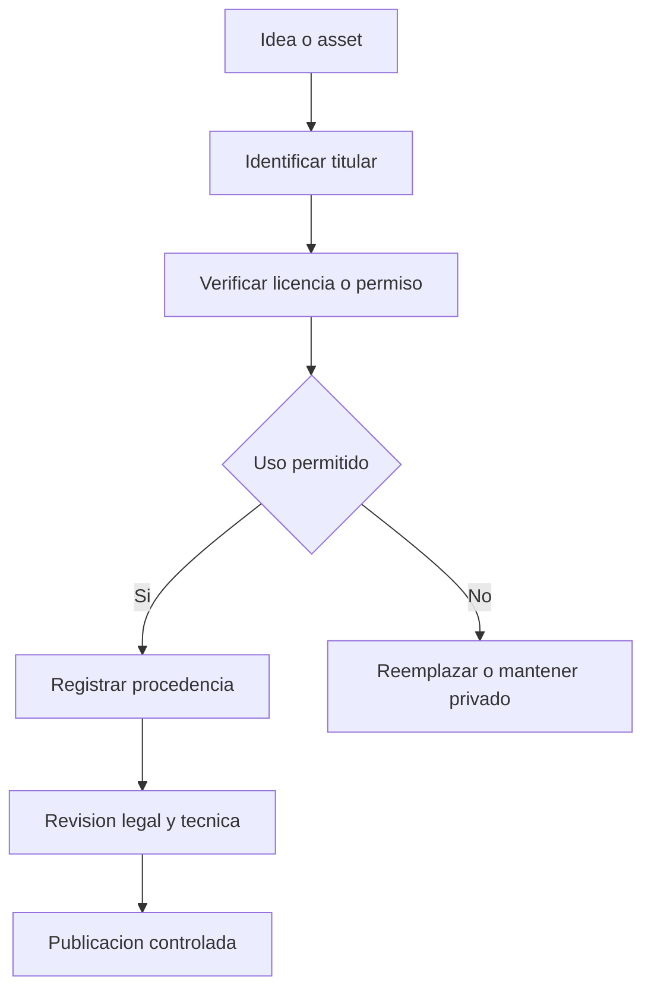

# Como protegemos la creatividad, los datos y el proyecto?

TL;DR: el proyecto puede ser un fan project gratuito, pero creditos, ausencia de lucro y baja posterior no equivalen a autorizacion previa.

## 1. Politica del proyecto

- El repositorio es un fan project gratuito y no afiliado.
- Se daran creditos completos a los titulares correspondientes.
- No se usaran creditos como sustituto de una licencia.
- No se monetizara el proyecto mientras use material no autorizado.
- Si un titular reclama, se retira el material y se registra la decision.
- No se afirmara que existe autorizacion si no hay evidencia escrita.

## 2. Derecho de autor y marca

La Ley chilena N 17.336, version BCN indicada como ultima version desde 2017-11-03, protege en su articulo 3 las composiciones musicales, obras audiovisuales, textos y programas computacionales. Sus articulos 17 y 18 reconocen facultades patrimoniales de uso, autorizacion y distribucion. Fuente oficial BCN, consultada el 2026-09-30: https://www.bcn.cl/leychile/navegar?idNorma=28933.

La licencia MIT de OpenPenguin se refiere al software distribuido en ese repositorio: https://raw.githubusercontent.com/GuiMar10/OpenPenguin/main/LICENSE, consultado el 30-09-2026. No se asumira que cubre assets de terceros. El README de OpenPenguin declara que el proyecto no esta afiliado a Disney: https://raw.githubusercontent.com/GuiMar10/OpenPenguin/main/README.md, consultado el 30-09-2026.

## 3. Datos personales por fase

| Fase | Norma y control |
|---|---|
| F0 local sin cuentas | No recolectar datos del juego; la investigacion usa `docs/12` y Ley 19.628 art. 4 y 11 |
| Cuentas | Ley 19.628 vigente hasta 30-11-2026: base de licitud, finalidad, diligencia y derechos |
| Desde 01-12-2026 | Ley 21.719 con proteccion desde el diseno, transparencia, seguridad y gestion de vulneraciones |
| Chat y menores | No abrir sin modelo de moderacion, minimizacion, retencion y evaluacion legal |

Fuentes oficiales consultadas el 30-09-2026:

- Ley 19.628, articulos 3, 4, 10, 11 y 12, version vigente consultada el 2026-09-30: https://www.bcn.cl/leychile/navegar?idNorma=141599&idVersion=2023-05-09.
- Ley 21.719, articulos 3, 12, 14 ter, 14 quinquies, 15 y 41, vigencia diferida indicada por BCN al 2026-12-01, consultada el 2026-09-30: https://www.bcn.cl/leychile/navegar?idNorma=1209272.
- Ley 21.663, articulos 4, 5, 6 y 9, version consultada el 2026-09-30: https://www.bcn.cl/leychile/navegar?idNorma=1202434.

La Ley 21.663 no se tratara como obligacion automatica para cualquier videojuego: su aplicabilidad depende del ambito legal de servicios esenciales y operadores de importancia vital. Se verificara con asesoramiento antes de operar un servicio real.

La investigacion de usuarios F0 se limita a adultos voluntarios y datos anonimizados. Si aparece un menor, una cuenta o un dato identificable no previsto, se detiene la ronda y se aplica el protocolo de privacidad antes de continuar.

## 4. Gate legal

| Estado | Significado |
|---|---|
| Verde | Licencia o permiso documentado |
| Amarillo | Riesgo identificado y uso restringido |
| Rojo | No publicar ni distribuir |

F0 puede avanzar en modo amarillo para un fan prototype, pero ninguna release comercial ni afirmacion de autorizacion se aprueba con recursos sin licencia verificada.

## 5. Limite

Este documento es control de proyecto y no asesoramiento legal. Antes de distribuir publicamente un paquete con material de terceros se requiere revision profesional.

## Over to you

Cada colaborador debe poder explicar la procedencia de su aporte antes de incorporarlo.
