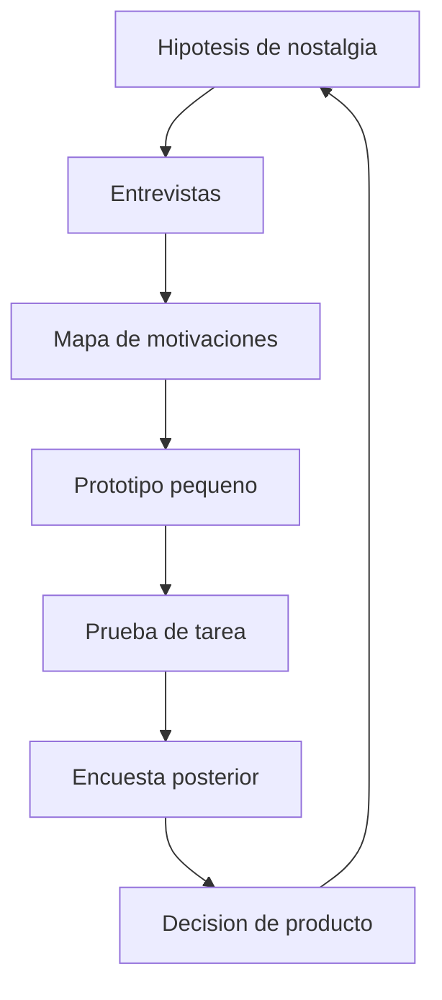

# Como validaremos el mercado sin confundir nostalgia con demanda?

TL;DR: investigamos el recuerdo y el comportamiento por separado; una persona puede amar un recuerdo y no querer jugar un producto nuevo.

## 1. Preguntas de mercado

- Que recuerdan realmente los usuarios: lugares, sonidos, ritmo, humor o comunidad?
- Que parte del recuerdo no depende de una marca concreta?
- Que alternativas usan hoy para juegos sociales tranquilos?
- Que los haria volver despues de la primera sesion?
- Que barreras existen: plataforma, tiempo, privacidad, moderacion o confianza?

## 2. Segmentos iniciales

| Segmento | Hipotesis | Como validar |
|---|---|---|
| Adulto nostalgico | Busca recrear una emocion pasada | Entrevista y recuerdo libre |
| Jugador casual | Valora sesiones cortas | Prueba de tarea y retorno |
| Creador comunitario | Valora expresion y pertenencia | Taller de co-creacion |
| Explorador nuevo | No tiene el recuerdo original | Comparar comprension sin contexto |

## 3. Competencia y comparables

Se estudiaran juegos sociales 2D, mundos persistentes, minijuegos casuales y proyectos fan. El estudio separara hechos observados, fuentes externas y nuestras hipotesis. No se usara la existencia de otro proyecto como prueba de demanda.

## 4. Experimento F0

Muestra pequena y cualitativa, sin datos sensibles: presentar un prototipo con placeholders, pedir completar el loop, preguntar que emocion produjo y medir si la persona puede describir el mundo sin que se le sugiera una marca.

## 5. Criterios de decision

- Continuar si la mayoria completa el loop y describe una emocion coherente.
- Corregir si existe interes pero la tarea es confusa.
- Replantear si el recuerdo depende exclusivamente de copiar una obra.
- Detener una idea si exige assets sin licencia para funcionar.

## Over to you

La nostalgia orienta las preguntas; las respuestas observadas deciden el backlog.
