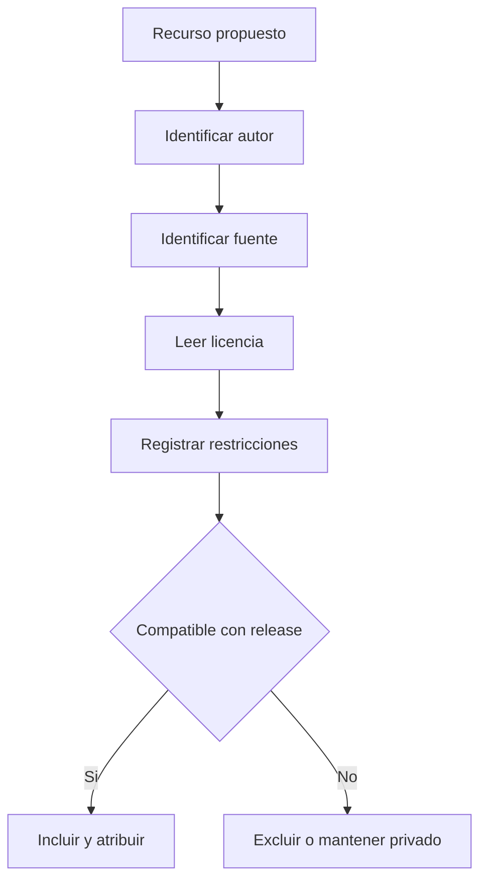

# Como sabemos si un asset puede entrar al proyecto?

TL;DR: ningun recurso entra por gusto o por credito solamente; entra con una ficha de procedencia, licencia compatible y revision.



## 1. Manifest obligatorio

Cada asset publicado debe registrar:

```text
id:
tipo:
autor:
fuente:
licencia:
url:
fecha_consulta:
atribucion_requerida:
usos_permitidos:
restricciones:
checksum:
estado:
```

## 2. Estados

- `verified`: licencia y procedencia verificadas.
- `pending`: falta evidencia; no entra en release.
- `private-reference`: solo referencia local; no se publica.
- `rejected`: incompatible o sin titular identificable.

## 3. Tipos de contenido

| Contenido | Politica F0 |
|---|---|
| Arte | Placeholder o licencia compatible |
| Musica | Silencio, tono generado o licencia compatible |
| Texto | Escrito para el proyecto, sin copiar dialogos |
| Fuentes | Licencia registrada y compatible |
| Capturas | Solo de builds y assets publicables |
| Referencias | Fuera de `assets/` y claramente marcadas |

## 3.1. Manifiestos registrados

- `assets/third-party/openpenguin/MANIFEST.md`: skin del pinguino fan-made,
  estado `risk-accepted`, con `SHA256SUMS` para verificar integridad.

## 4. Controles

- `.gitignore` bloquea `assets-private/`.
- Revision humana antes de cada asset nuevo.
- La revision humana del PR bloquea la integracion si falta el manifest o la licencia.
- El README mantiene creditos y avisos.
- La retirada de un recurso debe dejar registro y prueba de reemplazo.

## Over to you

La creatividad puede ser nostalgica; la procedencia debe ser aburridamente precisa.
