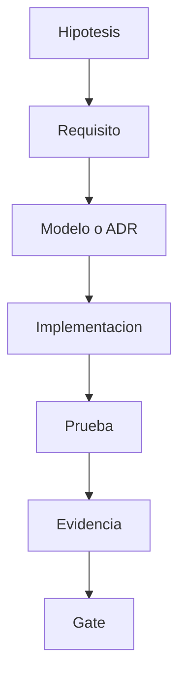

# Como conectamos requisitos, riesgos y pruebas?

TL;DR: la matriz evita que una promesa de producto quede sin diseno, prueba, responsable o evidencia.

## Matriz F0, F1 y F2

| ID | Fase | Hipotesis o fuente | Tipo | Prioridad | Modelo o ADR | Prueba prevista | Evidencia | Responsable | Estado |
|---|---|---|---|---|---|---|---|---|---|
| RF-001 | F1 | H-01 / vision | F | Must | CU-001, `06-session-state.puml` | Carga headless | Godot 4.7.2, code 0 | Implementador | Verified |
| RF-002 | F1 | H-01 / vision | F | Must | CU-002, `04-domain-class.puml` | Prueba de movimiento | `room_bounds`, code 0 | Implementador | Verified |
| RF-003 | F1 | H-02 / vision | F | Must | CU-003, `05-core-loop-sequence.puml` | Prueba de interaccion | distancia y recompensa, code 0 | Implementador | Verified |
| RF-004 | F1 | H-02 / vision | F | Must | CU-004, `04-domain-class.puml` | Test de inventario | invariantes, code 0 | Implementador | Verified |
| RF-005 | F1 | H-02 / vision | F | Must | CU-005, `03-use-cases.puml` | Smoke de UI | nombre y cantidad, code 0 | Implementador | Verified |
| RF-006 | F2 | H-01 / vision | F | Should | CU-006, `06-session-state.puml` | Salida limpia | Pendiente | Implementador | Planned |
| H-03 | F0 | Mercado y nostalgia | H | Must | `09-mercado-y-nostalgia.md` | Prueba de retorno | Pendiente | Investigador | Planned |
| H-04 | F0 | Mercado y procedencia | H | Must | `10-procedencia-de-assets.md` | Revision de assets | Pendiente | Legal | Planned |
| RNF-001 | F1 | Calidad | NF | Must | `03-ciclo-de-vida-iso-12207.md#5-gate-f0` | Runner headless | Godot 4.7.2, code 0 | Verificador | Verified |
| RNF-002 | F0 | Calidad | NF | Must | Git y GitHub | Revision de secretos y binarios | Pendiente | Seguridad | Planned |
| RNF-003 | F0 | Legalidad | NF | Must | `10-procedencia-de-assets.md#1-manifest-obligatorio` | Revision de procedencia | Pendiente | Legal | Planned |
| RNF-004 | F0 | Calidad | NF | Must | UML y Mermaid | Validacion de fuentes | Pendiente | Verificador | Planned |
| RNF-005 | F1 | Calidad | NF | Should | `04-arquitectura-y-patrones.md#1-limites-del-sistema` | Smoke y logs | salida sin warnings | Implementador | Verified |
| RNF-006 | F0 | Proceso | NF | Must | `03-ciclo-de-vida-iso-12207.md` | Checklist de PR | Pendiente | Maintainer | Planned |
| CU-001 | F1 | Vision | CU | Must | `06-casos-de-uso-y-abuso.md` | Prueba de inicio | main scene, code 0 | Implementador | Verified |
| CU-002 | F1 | Vision | CU | Must | `06-casos-de-uso-y-abuso.md` | Prueba de limites | clamp, code 0 | Implementador | Verified |
| CU-003 | F1 | Vision | CU | Must | `06-casos-de-uso-y-abuso.md` | Prueba de interaccion | distancia, code 0 | Implementador | Verified |
| CU-004 | F1 | Vision | CU | Must | `06-casos-de-uso-y-abuso.md` | Prueba de item | item y cantidad, code 0 | Implementador | Verified |
| CU-005 | F1 | Vision | CU | Must | `06-casos-de-uso-y-abuso.md` | Smoke de UI | nombre visible, code 0 | Implementador | Verified |
| CU-006 | F2 | Vision | CU | Should | `06-casos-de-uso-y-abuso.md` | Salida limpia | Pendiente | Implementador | Planned |
| AB-001 | F1 | CU-001 | AB | Must | `04-arquitectura-y-patrones.md#1-limites-del-sistema` | Datos corruptos | Pendiente | Seguridad | Planned |
| AB-002 | F1 | CU-002 | AB | Must | `04-domain-class.puml` | Posicion invalida | clamp, code 0 | Seguridad | Verified |
| AB-003 | F1 | CU-003 | AB | Must | `05-core-loop-sequence.puml` | Replay de recompensa | one-shot, code 0 | Seguridad | Verified |
| AB-004 | F1 | CU-004 | AB | Must | `04-domain-class.puml` | Cantidad negativa | inventory tests, code 0 | Seguridad | Verified |
| AB-005 | F2 | CU-005 | AB | Should | `03-ciclo-de-vida-iso-12207.md#3-fases` | Estado corrupto | Pendiente | Seguridad | Planned |
| AB-006 | F2 | CU-006 | AB | Should | `03-ciclo-de-vida-iso-12207.md#3-fases` | Cierre durante save | Pendiente | Seguridad | Planned |

## Riesgos de gobernanza

| ID | Fase | Riesgo | Control | Evidencia | Responsable | Estado |
|---|---|---|---|---|---|---|
| RG-001 | F0 | Publicar asset sin licencia | Manifest y revision | Ficha de asset | Legal | Planned |
| RG-002 | F0 | Investigar sin consentimiento | Protocolo de usuarios | Consentimiento y notas anonimas | Legal | Planned |
| RG-003 | F0 | Permiso excesivo en repo o agente | `SECURITY.md` y roles | Revision de permisos | Seguridad | Planned |

## Regla de cierre

Un elemento `Planned` no se presenta como funcional. El estado cambia a
`Verified` solo con comando, resultado y revision asociados.

## Over to you

La matriz se actualiza en el mismo PR que cambia el comportamiento, no en una limpieza posterior.
