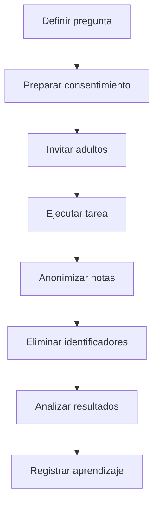

# Como investigamos con usuarios sin convertirlos en datos de prueba?

TL;DR: F0 usa pruebas anonimizadas y voluntarias; se conserva el aprendizaje agregado, no la identidad ni el contenido identificable.

## 1. Alcance F0

- Participantes adultos y voluntarios.
- Sin cuentas del juego.
- Sin nombre real, correo, documento, ubicacion precisa ni grabacion por defecto.
- La identificacion de la sesion es un codigo aleatorio temporal.
- El equipo conserva solo resultados agregados y notas anonimizadas.
- Las notas y resultados brutos viven fuera del repositorio en `research-private/`
  o en un almacenamiento privado equivalente; nunca se versionan.

## 2. Base y consentimiento

La Ley 19.628, articulo 4, version vigente consultada el 2026-09-30, exige autorizacion legal o consentimiento expreso para el tratamiento; su articulo 11 exige diligencia del responsable: https://www.bcn.cl/leychile/navegar?idNorma=141599&idVersion=2023-05-09.

Antes de cada prueba se explica objetivo, duracion, datos observados, uso, retiro y contacto. La persona puede abandonar sin justificarlo. No se reclutan menores en F0.

## 3. Retencion y borrado

Las notas brutas se eliminan al finalizar el analisis de la ronda. Los resultados agregados se conservan hasta que dejen de aportar a una decision de producto. Una solicitud de retiro elimina cualquier material que pueda volver a identificar a la persona. No se graba audio, video o pantalla por defecto; cualquier excepcion requiere consentimiento separado.

## 4. Reporte de resultados

Cada ronda documenta version, pregunta, numero de participantes, tareas, exito, fracaso, sesgos conocidos y decision. No se publican citas que permitan identificar a una persona.

## 5. Escalamiento

Si aparecen cuentas, menores, chat, telemetria persistente, voz o contenido creado por usuarios, se detiene la investigacion y se actualiza el analisis legal y de privacidad antes de continuar.

## Over to you

Una buena prueba produce aprendizaje reproducible sin convertir la intimidad del participante en una funcionalidad.
