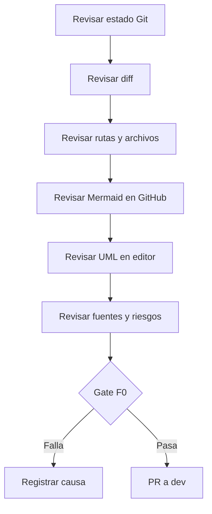

# Como verificamos F0 sin scripts propios?

TL;DR: F0 se verifica con herramientas nativas de Git, GitHub, Markdown, Mermaid y Godot cuando exista el proyecto ejecutable.



## 1. Comandos nativos

Ejecutar desde la raiz del repositorio:

```text
git status --short --branch
git diff --check
git diff --cached --check
git diff --name-status
git diff --cached --name-status
git ls-files
```

Cuando exista el proyecto Godot:

```text
godot --version
godot --headless --editor --quit --path .
```

Los comandos se ejecutan manualmente y su salida se conserva en el reporte de
la fase. No se agrega un validador casero ni una lista duplicada de archivos.

## 2. Comprobaciones

- El diff contiene solo archivos intencionados.
- No hay secretos, datos personales, binarios ni assets privados.
- GitHub muestra los Mermaid sin error.
- Los `.puml` abren en el editor disponible.
- Cada requisito tiene aceptacion y evidencia prevista.
- Cada caso de uso tiene abuso o riesgo asociado.
- Cada fuente legal tiene articulo, version, URL y fecha.
- La revision de seguridad no tiene bloqueos abiertos.

## 3. Resultado

El gate puede quedar `READY`, `BLOCKED` o `NEEDS-INFO`. `READY` no significa
que el juego este terminado; significa que F0 documental esta lista para abrir
la implementacion F1.

## Over to you

La persona que aprueba el PR confirma la salida de cada comando y no solo que
el documento parece correcto.
