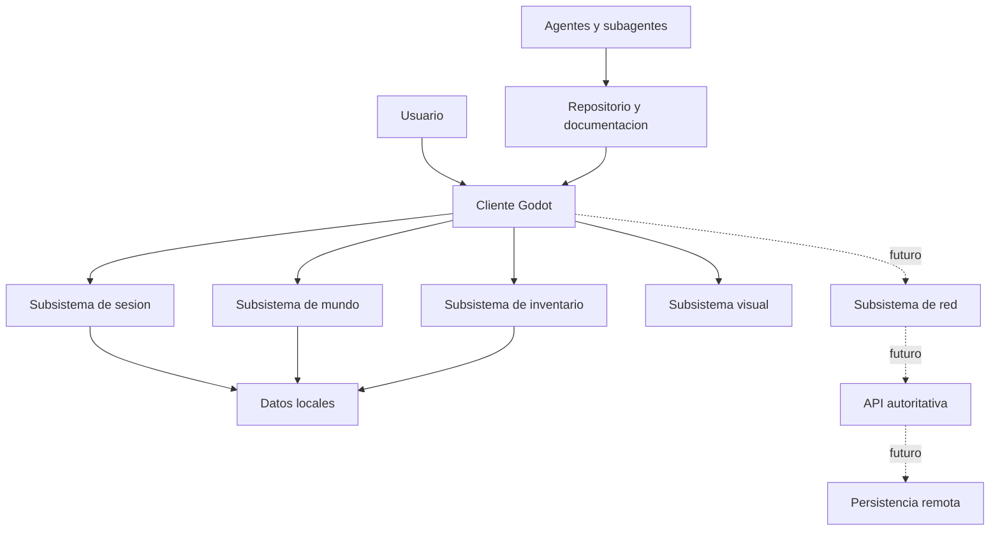

# Como se divide el sistema y donde estan sus fronteras de seguridad?

TL;DR: el producto es un sistema abierto compuesto por subsistemas con responsabilidades, datos y limites de confianza explicitos.

## 1. Sistema de interes

En F0 el sistema de interes es la documentacion y el futuro cliente local. El
usuario, el sistema operativo, GitHub, colaboradores, titulares de derechos y
posibles proveedores de assets son entorno, no componentes confiables.

## 2. Subsistemas

| Subsistema | Datos | Confianza | Regla |
|---|---|---|---|
| Sesion | Estado temporal | Cliente local | No contiene secretos |
| Mundo | Salas y posiciones | Cliente en F1 | Valida limites |
| Inventario | Items y cantidades | Dominio | Mantiene invariantes |
| Visual | Escenas y UI | Presentacion | No decide autoridad |
| Datos locales | Guardado futuro | Equipo del usuario | Versionado y recuperacion |
| Red futura | Intenciones y snapshots | Limite externo | Servidor autoritativo |
| Repositorio | Codigo y docs | Publico | Sin datos privados |
| Agentes | Cambios y revisiones | Limite operativo | Minimo privilegio |

## 3. Fronteras de confianza

1. Usuario hacia cliente: input no confiable.
2. Cliente hacia dominio: intencion validada.
3. Cliente hacia datos locales: contenido potencialmente corrupto.
4. Cliente hacia red futura: transporte no confiable.
5. Colaborador hacia repositorio: cambio sujeto a revision.
6. Asset externo hacia build: licencia, formato y contenido no confiables.
7. Agente hacia repositorio: herramienta con capacidad limitada y salida no confiable.

## 4. Controles por frontera

- Validar tipos, rangos, identificadores y tamanos.
- No confiar en estado enviado por un cliente futuro.
- No cargar rutas arbitrarias ni permitir traversal.
- Separar contenido privado del repositorio publico.
- Aplicar minimo privilegio a usuarios, agentes y tokens.
- Separar agentes implementadores de agentes revisores y del aprobador humano.
- Registrar decisiones sin guardar datos personales innecesarios.

## Over to you

Cada nuevo subsistema debe declarar su entrada, salida, datos, frontera de
confianza, fallo esperado y prueba antes de integrarse.
