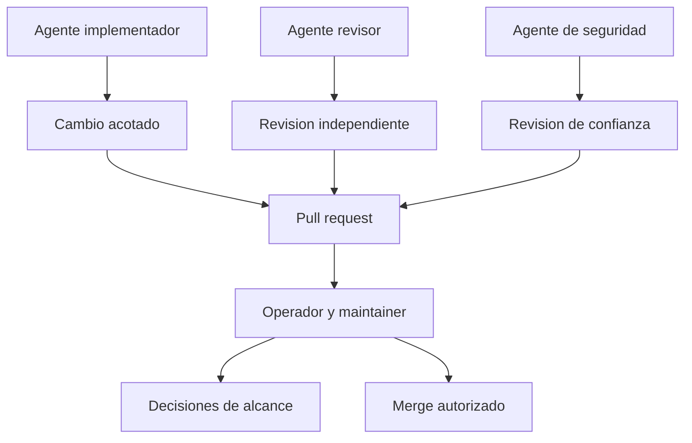

# Quien puede decidir, revisar y publicar?

TL;DR: las personas y agentes operan con minimo privilegio; quien implementa no se autoaprueba y nadie publica directamente en `main`.

## 1. Roles

| Rol | Puede hacer | No puede hacer sin autorizacion |
|---|---|---|
| Operador y maintainer | Aprobar alcance, permisos, merges y releases | Exponer secretos o saltarse gates |
| Implementador | Leer el contexto necesario y editar su rama | Aprobar su propio cambio o tocar `main` |
| Revisor | Leer, ejecutar comprobaciones y reportar hallazgos | Editar archivos o hacer push |
| Revisor de seguridad | Analizar fronteras, permisos y datos | Probar terceros o credenciales reales |
| Participante | Entregar feedback voluntario | Dar datos de otros participantes |

## 2. Agentes y subagentes

- Se delegan tareas pequenas, acotadas y reversibles.
- El agente recibe solo el directorio y contexto necesarios.
- Los revisores trabajan en modo lectura.
- No se pasan secretos, tokens, datos personales ni assets privados.
- El agente principal integra cambios complejos y resuelve conflictos.
- Toda salida de un agente se trata como evidencia pendiente hasta verificarla.
- Ningun agente recibe tokens, credenciales, datos de participantes o assets privados por defecto.
- Un agente que edita no puede ser la unica aprobacion de su propia PR.

## 3. Aprobacion

Una PR requiere revision del operador, comprobaciones documentadas y ausencia de
bloqueos criticos. La persona que implementa puede explicar el cambio, pero no
puede ser la unica aprobadora.

## Over to you

Los roles se revisan cuando aparezca un colaborador, una cuenta, un servidor o
un nuevo tipo de dato.
