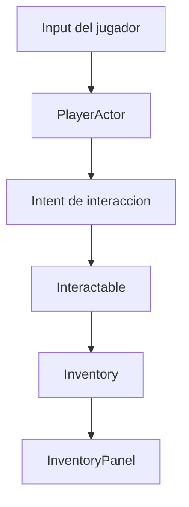

# Como funciona la primera vertical slice local?

TL;DR: F1 demuestra una sala local donde el jugador se mueve, interactua con una concha azul y la ve en el inventario.



## 1. Componentes entregados

| Componente | Ubicacion | Responsabilidad |
|---|---|---|
| Proyecto | `project.godot` | Configuracion nativa Godot 4.7 |
| Sala | `src/scenes/main.tscn` | Composicion del slice local |
| Jugador | `src/actors/player_actor.gd` | Movimiento e interaccion |
| Skin | `src/actors/penguin_skin.tscn` | Skin fan-made con caminata; sin ella vale el placeholder |
| Interactable | `src/actors/interactable.gd` | Distancia y recompensa |
| Item | `src/data/items/blue_shell.tres` | Datos declarativos del objeto |
| Dominio | `src/domain/inventory.gd` | Cantidades e invariantes |
| UI | `src/ui/inventory_panel.gd` | Nombre y cantidad del item |
| Pruebas | `tests/` | Tests headless nativos de Godot |

## 2. Smoke test manual

1. Abrir el proyecto con Godot 4.7.2.
2. Ejecutar la escena principal.
3. Mover el avatar con las flechas.
4. Acercarse a la concha azul.
5. Presionar Enter.
6. Confirmar `Concha azul x1` en el inventario.
7. Presionar Enter otra vez y confirmar que no aumenta la cantidad.
8. Intentar salir de la sala y confirmar que el avatar queda dentro de sus limites.

## 3. Verificacion automatizada

Desde la raiz del repositorio:

```text
godot --headless --editor --quit --path .
godot --headless --path . --script res://tests/run_tests.gd
```

La evidencia F1 debe registrar version de Godot, codigo de salida y salida
completa. En esta fase no se agregan cuentas, red, chat, guardado o assets
originales de Club Penguin.

## 4. Contenido original integrado

Ademas del slice local, el proyecto incluye el contenido fan-made de
OpenPenguin verificado en Godot 4.7.2:

- `rooms/town/` Town actual y OG, `rooms/cofffee_shop/`, `rooms/box_dimension/`
- `minigames/astro barrier/` 4 niveles y terminal, `minigames/thin ice/`
- `hud/` pantallas de carga y login
- Skin del pinguino con caminata en `src/actors/penguin_skin.tscn`

Evidencia: 5 tests F1 en verde y 11 escenas instanciadas sin errores de
script. Detalle y procedencia en `docs/17` y el manifiesto de terceros.

## 5. Riesgos abiertos

- No existe persistencia entre sesiones; corresponde a F2.
- La interaccion local aun no es una autoridad de servidor; corresponde a F4.
- El arte es placeholder y no representa una autorizacion de derechos.
- La prueba manual todavia debe ejecutarse con usuario y registrarse.

## Over to you

F1 se cierra cuando el slice es reproducible, la prueba manual queda registrada
y la PR pasa revision tecnica y de seguridad.
