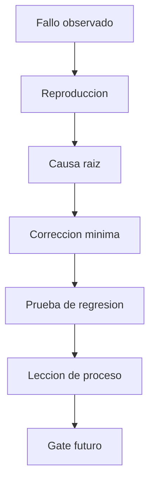

# Que errores encontramos en F1 y como evitamos repetirlos?

TL;DR: cada fallo deja causa raiz, correccion, evidencia y una regla reutilizable para las siguientes fases.



## 1. Registro de errores F1

| ID | Error encontrado | Causa raiz | Solucion aplicada | Prevencion futura | Estado |
|---|---|---|---|---|---|
| ERR-001 | La rama documental aparecia con el mismo commit para todos los archivos | El commit raiz agrego toda la base de una vez | Commits posteriores separados por responsabilidad y merge sin squash | Revisar historial y vista de archivos antes del PR | Resuelto |
| ERR-002 | `SECURITY.md` estaba en ingles y el About no explicaba el producto | La identidad se documento desde la estructura tecnica, no desde el usuario | Traduccion, descripcion humana y alcance fan-made explicito | Revisar README y About como parte de F0 | Resuelto |
| ERR-003 | Se describia el proyecto como inspirado, no como recreacion fan-made | La vision inicial priorizo el riesgo legal y cambio el objetivo creativo | README, About y vision declaran recreacion fan-made de Club Penguin | Confirmar identidad del producto antes de modelar | Resuelto |
| ERR-004 | `top to bottom direction` rompia un diagrama UML de secuencia | Se aplico una directiva de direccion que PlantUML ignora o rechaza en secuencias | Se retiro la directiva; la secuencia mantiene orden vertical natural | Renderizar cada tipo UML antes del gate | Resuelto |
| ERR-005 | El recurso de item no tenia `id` | El `.tres` declaraba nombre y categoria, pero no la clave primaria | Se agrego `id = "blue_shell"` y se cubrio con test | Validar todos los campos de recursos declarativos | Resuelto |
| ERR-006 | El test probaba un `Interactable` aislado, no el de la escena real | El runner construia un nodo huérfano con radio distinto al de produccion | El test instancia `main.tscn` y usa sus nodos y valores reales | Los tests de integracion deben usar la escena ensamblada | Resuelto |
| ERR-007 | Movimiento y limites no tenian prueba | El clamp existia en gameplay, pero no estaba expuesto a una prueba directa | Se separo `clamp_to_room()` y se probo con los limites declarados | Cada abuso Must debe tener prueba automatizada o evidencia manual | Resuelto |
| ERR-008 | La UI no tenia prueba del nombre visible del item | El runner solo comprobaba tipos de nodos | Se verifica `Concha azul x1` desde la instancia real | Los smoke tests deben comprobar salida observable | Resuelto |
| ERR-009 | El runner dejaba recursos del motor vivos al salir | Nodos y recursos quedaban referenciados durante el cierre | Se liberan nodos y se espera un frame antes de finalizar | Ejecutar tests con salida limpia y sin warnings | Resuelto |
| ERR-010 | La matriz de trazabilidad seguia en `Planned` despues de implementar | El codigo se cambio sin actualizar la evidencia en el mismo cambio | Se actualiza la matriz junto con cada gate F1 | El PR no cierra si la matriz contradice el codigo | En curso |
| ERR-011 | Godot no estaba instalado en el entorno | El repositorio solo tenia documentacion F0 | Se instalo Godot 4.7.2 fuera del repo y se verifico su version | Registrar herramienta y version antes de F1 | Resuelto |
| ERR-012 | Los SVG generados por verificadores quedaron fuera del control de Git | Los artefactos de render se crearon en carpetas no ignoradas | Se eliminaron y se ignoraron `docs/assets/smoke/` y `docs/assets/out/` | No versionar salidas generadas ni usar `git add -A` sin revisar | Resuelto |

## 2. Reglas derivadas

- Un test de integracion usa la escena real y sus recursos declarativos.
- Un test que fija un valor distinto al de produccion no es evidencia suficiente.
- Cada bug de datos agrega una prueba que valide la clave y los campos obligatorios.
- Cada cambio de gameplay actualiza la matriz de trazabilidad en el mismo PR.
- Los renderizadores se verifican por tipo de diagrama, no solo por archivo de texto.
- Las fugas, warnings y errores de salida bloquean el gate aunque el resultado principal parezca correcto.
- Las herramientas de desarrollo viven fuera del repositorio; el proyecto conserva solo configuracion y fuentes necesarias.
- La documentacion publica debe explicar producto, alcance, riesgos y siguiente paso en lenguaje humano.

## 3. Evidencia F1

Comandos ejecutados:

```text
godot --headless --editor --quit --path .
godot --headless --verbose --path . --script res://tests/run_tests.gd
godot --headless --path . --quit-after 2
```

Resultado esperado y obtenido: importacion correcta, tests de inventario,
limites, distancia, inventario visible y carga de escena correctos, sin fugas
del motor en la salida final.

## 4. Pendientes honestos

- Falta ejecutar el smoke test con una persona usando la ventana del juego.
- Falta actualizar la evidencia final de la matriz despues de esa prueba manual.
- Persistencia, red, cuentas, chat y assets de produccion siguen fuera de F1.

## Over to you

Antes de abrir una nueva fase, se revisa este registro y se convierte cada
leccion aplicable en requisito, test, control o criterio de gate.
