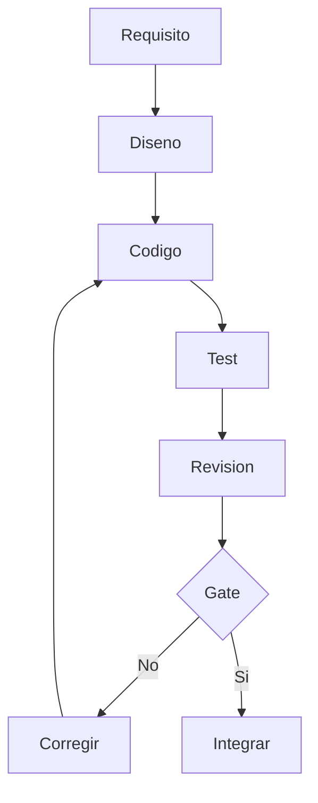

# Como avanza una fase de Penguin Legacy?

```mermaid
flowchart TD
    A[Requisito] --> B[Diseno]
    B --> C[Codigo]
    C --> D[Test]
    D --> E[Revision]
    E --> F{Gate}
    F -- No --> G[Corregir]
    G --> C
    F -- Si --> H[Integrar]
```
