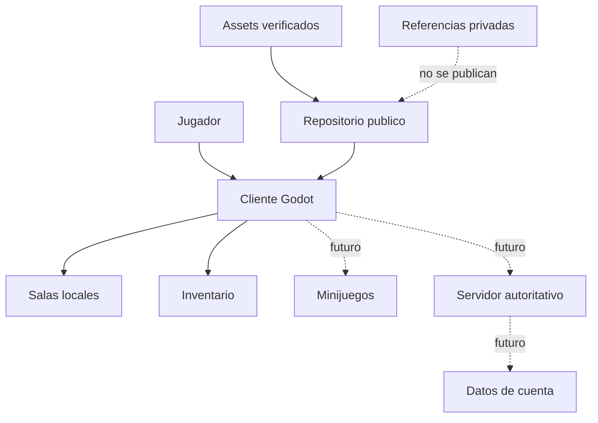

# Cual es el contexto del sistema?

```mermaid
flowchart TD
    U[Jugador] --> C[Cliente Godot]
    C --> R[Salas locales]
    C --> I[Inventario]
    C -. futuro .-> M[Minijuegos]
    C -. futuro .-> N[Servidor autoritativo]
    N -. futuro .-> D[Datos de cuenta]
    E[Repositorio publico] --> C
    P[Assets verificados] --> E
    Q[Referencias privadas] -. no se publican .-> E
```
