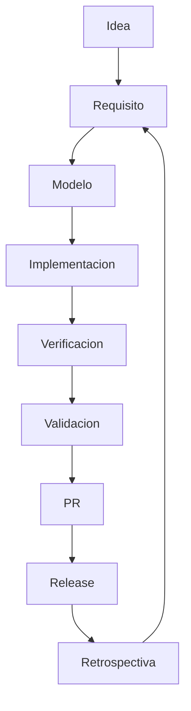

# Que controles atraviesa cada cambio?

```mermaid
flowchart TD
    A[Idea] --> B[Requisito]
    B --> C[Modelo]
    C --> D[Implementacion]
    D --> E[Verificacion]
    E --> F[Validacion]
    F --> G[PR]
    G --> H[Release]
    H --> I[Retrospectiva]
    I --> B
```
